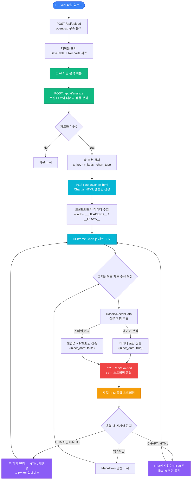
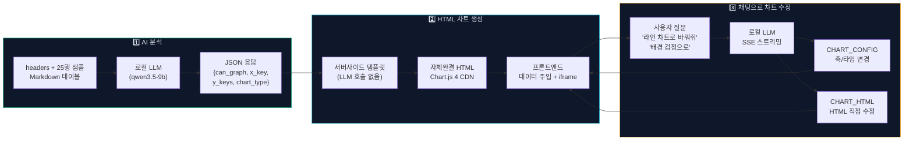

# Excel AI Analyzer

Excel 파일을 업로드하면 자동 파싱, 인터랙티브 차트, AI 분석·채팅까지 제공하는 풀스택 웹 앱.  
**핵심 설계 원칙**: 로컬 LLM(LM Studio)을 파서 보완 + AI 분석 + 코드 생성에 단계적으로 활용하고, 비용·속도·개인정보 보호를 모두 충족합니다.

---

## 목차

1. [플로우차트](#플로우차트)
2. [Tech Stack](#tech-stack)
3. [전체 아키텍처](#전체-아키텍처)
3. [데이터 흐름](#데이터-흐름)
4. [AI 작동 방식 — 4가지 모듈](#ai-작동-방식--4가지-모듈)
5. [프롬프트 엔지니어링 전략](#프롬프트-엔지니어링-전략)
6. [HTML 차트 데이터 주입 패턴](#html-차트-데이터-주입-패턴)
7. [2단계 파서](#2단계-파서-parserpy)
8. [빠른 시작](#빠른-시작)
9. [주요 설정값](#주요-설정값)
10. [API Reference](#api-reference)
11. [Troubleshooting](#troubleshooting)

---

## 플로우차트

### 전체 플로우



### AI 차트 생성 · 수정 상세



---

## Tech Stack

| Layer | 기술 |
|---|---|
| Backend | Python 3.9+, FastAPI, uvicorn, openpyxl |
| Frontend | Next.js 15 (App Router), TypeScript, Tailwind CSS v4, Recharts |
| AI | LM Studio (로컬 LLM, OpenAI-compatible) — 기본값: `qwen/qwen3.5-9b` |
| HTML Chart | Chart.js 4 (브라우저 CDN) |
| Container | Docker + Docker Compose |

---

## 전체 아키텍처

```
┌─────────────────────────────────────────────────────────────────┐
│  Browser (Next.js 15)                                           │
│                                                                 │
│  FileUpload → DataTable / DataChart (Recharts)                  │
│              ↕                                                  │
│  AiAnalysisPanel                                                │
│    ├─ HtmlChartPreview  ← AI 생성 Chart.js HTML (iframe)        │
│    └─ ChatPanel         ← 스트리밍 채팅 (SSE)                   │
└───────────────────────────────┬─────────────────────────────────┘
                                │ HTTP / SSE
┌───────────────────────────────▼─────────────────────────────────┐
│  FastAPI Backend (port 8000)                                    │
│                                                                 │
│  /api/upload          POST  — 2단계 파서                        │
│  /api/chart-data      POST  — 차트 메타데이터 생성              │
│  /api/ai/analyze      POST  — Module 1+2: 축 추천               │
│  /api/ai/report       POST  — Module 3: SSE 스트리밍 채팅       │
│  /api/ai/chart-html   POST  — Module 4: HTML 차트 템플릿 생성   │
│  /api/ai/status       GET   — LLM 연결 상태                     │
└───────────────────────────────┬─────────────────────────────────┘
                                │ OpenAI-compatible API
┌───────────────────────────────▼─────────────────────────────────┐
│  LM Studio  localhost:1234                                      │
│  model: qwen/qwen3.5-9b  (교체 가능)                           │
└─────────────────────────────────────────────────────────────────┘
```

---

## 데이터 흐름

### 1. 파일 업로드 → 테이블 표시

```
사용자 .xlsx 선택
  → POST /api/upload (multipart)
      → parse_stage1(): 구조 분석 (heuristic)
          confidence < 0.6 이고 LLM 활성화?
            → parse_stage2(): LLM 폴백 (OpenAI/Gemini)
      ← { headers, rows, confidence, stage, sheet_names }
  → DataTable (편집 가능)
  → DataChart (Recharts — Bar/Line/Pie/Scatter)
```

### 2. AI 자동 분석 (축 추천)

```
업로드 완료 or "AI 분석" 버튼
  → POST /api/ai/analyze
      → LLM: "이 테이블을 차트로 그릴 수 있나요? X/Y축을 추천해줘"
      ← { can_graph, x_key, y_keys, chart_type }
  → DataChart 축 자동 업데이트
  → POST /api/ai/chart-html  (LLM 호출 없음 — 템플릿)
      ← { html: "<!DOCTYPE html>..." }
  → iframe 으로 Chart.js HTML 렌더링
```

### 3. AI 채팅 (분석 질문 + 차트 제어)

```
사용자 질문 입력
  → classifyNeedsData() — 스타일 전용 요청이면 데이터 생략
  → POST /api/ai/report (SSE 스트리밍)
      context: 데이터 샘플 Markdown 테이블 + 현재 HTML 차트 코드
      → LLM이 응답 스트리밍
      → 응답 내 지시어 파싱:
          CHART_CONFIG:{...}            → DataChart 축/타입 변경
          <CHART_HTML>...</CHART_HTML>  → iframe HTML 교체
```

---

## AI 작동 방식 — 4가지 모듈

### Module 1+2 — 차트 가능성 판단 & 축 추천 (`analyze_table`)

파일 업로드 직후 LLM에 데이터 샘플을 보내 그래프화 가능 여부와 최적 축을 결정합니다.

```
입력: headers + 최대 25행 샘플 (Markdown 테이블 형식)
출력: { can_graph, reason, x_key, y_keys, chart_type }
```

**핵심 구현 포인트:**
- `temperature=0.0` — 결정론적 JSON 출력
- Assistant prefill (`{`) — LLM이 JSON 이전에 prose를 출력하는 것을 방지
- `_extract_json()` — LLM이 prose를 섞어 출력해도 JSON 블록을 4단계로 추출

### Module 3 — 스트리밍 채팅 분석 (`stream_report`)

사용자의 자연어 질문에 Markdown 형식으로 스트리밍 답변합니다.  
답변 내에 특수 지시어를 포함시켜 차트를 동적으로 제어합니다.

```
입력: headers + rows + 현재 차트 HTML + 대화 히스토리 + 질문
출력: SSE 스트리밍 텍스트 (Markdown + 선택적 지시어)
```

**두 가지 지시어:**

| 지시어 | 용도 | 예시 |
|---|---|---|
| `CHART_CONFIG:{...}` | Recharts 차트의 축/타입 변경 | `CHART_CONFIG:{"x_key":"날짜","y_keys":["매출"],"chart_type":"line"}` |
| `<CHART_HTML>...</CHART_HTML>` | AI가 직접 수정한 Chart.js HTML 전체 교체 | 색상, 배경, 커스텀 시각화 등 |

**비용 최적화 — 데이터 주입 생략 (`inject_data`):**

`classifyNeedsData()` 함수가 질문을 분석해 스타일 전용 요청인지 판별합니다.  
"색상을 파란색으로 바꿔줘" 같은 요청은 실제 행 데이터 없이 컬럼명 + 현재 HTML만 전달해 토큰을 절약합니다.

```typescript
// 스타일 전용 키워드 감지 → inject_data: false (토큰 절약)
const styleOnly    = ["색상", "배경", "제목", "폰트", "범례", "border", ...]
const dataRequired = ["분석", "트렌드", "통계", "평균", "인사이트", ...]
```

### Module 4 — HTML 차트 템플릿 생성 (`generate_chart_html`)

**LLM 호출 없음.** 선택된 축과 옵션으로 자체완결 Chart.js HTML을 서버 사이드에서 즉시 생성합니다.

```
입력: headers, rows, x_key, y_keys, chart_type, custom_options
출력: 완전한 HTML 문자열 (Chart.js CDN 포함)
```

- 500개 초과 데이터 포인트는 `_smart_sample()`로 자동 다운샘플
- 색상 팔레트, y축 범위, 제목, 범례 등 `custom_options`으로 세밀 제어

---

## 프롬프트 엔지니어링 전략

### Qwen3 특화 처리

Qwen3 계열 모델은 `<think>...</think>` 내부 추론 블록을 출력합니다.

**1) 시스템 프롬프트 지시어**

```
/no_think
```

Qwen3의 내부 추론 모드를 비활성화하는 지시어를 시스템 프롬프트 첫 줄에 삽입합니다.

**2) SSE 스트리밍 실시간 필터링**

청크 경계를 걸쳐 발생하는 `<think>` 블록도 버퍼(`think_buf`)로 안전하게 처리합니다:

```python
# stream_report() 내부
while combined:
    if in_think:
        end = combined.find("</think>")
        if end == -1:
            think_buf = combined  # 다음 청크에서 이어서 처리
            break
        combined = combined[end + len("</think>"):]
        in_think = False
    ...
```

**3) Assistant Prefill (analyze에서)**

```python
messages=[
    {"role": "system",    "content": ANALYZE_SYSTEM},
    {"role": "user",      "content": user_msg},
    {"role": "assistant", "content": "{"},  # ← JSON 강제 시작
]
# LLM은 '{' 이후부터 생성 → 응답에 '{' 를 prepend해서 완성
raw = "{" + response.choices[0].message.content
```

### 토큰 예산 관리

```python
LOCAL_LLM_MAX_SAMPLE_ROWS   = 25      # 분석용 데이터 샘플 행
LOCAL_LLM_MAX_TOKENS        = 4096    # 리포트/채팅 응답 최대 토큰
LOCAL_LLM_MAX_PROMPT_CHARS  = 10000   # 프롬프트 데이터 문자 제한 (~2500 토큰)

# 16384 context window 기준:
# system(~300) + data(~2500) + history(~1000) + response(4096) ≈ 7900 토큰
```

### 스마트 샘플링 (`_smart_sample`)

대용량 파일에서 대표성 있는 행을 선택합니다:

| 데이터 크기 | 전략 |
|---|---|
| ≤ max_rows | 전체 반환 |
| ≤ 5× max_rows | 앞 1/5 + 등간격 중간 + 뒤 1/5 |
| 매우 큰 파일 | 앞 10% + 등간격 80% + 뒤 10% |

### JSON 강건성 (`_extract_json`)

LLM 응답이 완벽한 JSON이 아니어도 4단계로 추출을 시도합니다:

```
1. json.loads() 직접 시도
2. "can_graph" 키 포함 블록 regex 탐색
3. 첫 '{' ~ 마지막 '}' 그리디 추출
4. 모든 '{' 위치에서 바깥 방향으로 탐색
```

---

## HTML 차트 데이터 주입 패턴

AI가 생성한 HTML에 실제 데이터를 안전하게 주입하는 패턴입니다.

**문제**: AI가 수천 행의 데이터를 HTML에 하드코딩하면 토큰 폭발 + HTML 비대화.

**해결**: AI는 `window.__HEADERS__` / `window.__ROWS__` 전역 변수를 참조하는 코드만 생성하고,  
프론트엔드(`HtmlChartPreview.tsx`)가 실제 데이터를 iframe 내 `<script>` 태그로 주입합니다.

```typescript
// HtmlChartPreview.tsx — iframe 렌더링 전에 데이터 주입
function injectDataGlobals(html: string, headers: string[], rows: CellValue[][]): string {
    const script = `<script>
window.__HEADERS__ = ${JSON.stringify(headers)};
window.__ROWS__ = ${JSON.stringify(rows)};
</script>`;
    return html.replace("<head>", `<head>\n${script}`);
}
```

```javascript
// AI 생성 HTML 내부 — 항상 이 패턴으로 데이터 접근
const headers = window.__HEADERS__ || [];
const rows    = window.__ROWS__    || [];
const xIdx    = headers.indexOf('날짜');
const labels  = rows.map(r => r[xIdx]);
```

AI는 **구조와 스타일 코드만** 생성하고, **전체 데이터는 프론트엔드가 런타임에 주입**합니다.  
이 패턴은 시스템 프롬프트(`REPORT_SYSTEM`)에 명시적 규칙으로 정의되어 있습니다.

---

## 2단계 파서 (`parser.py`)

### Stage 1 — 구조 분석 (heuristic, LLM 없음)

openpyxl로 Excel을 읽어 테이블을 추출합니다.

```
1. _build_raw_grid()      — 병합 셀 값 전파 (merge_map으로 추적)
2. _find_table_region()   — 셀 밀도(> 0.2)로 테이블 경계 자동 탐지
3. _detect_header_rows()  — 문자열 비율 기반 헤더 행 수 판별 (1~2행)
4. _flatten_headers()     — 다중 헤더를 "대분류 > 소분류" 형태로 병합
5. _compute_confidence()  — 신뢰도 점수 계산 (0.0~1.0)
```

**신뢰도 감점 요인:**

| 조건 | 감점 |
|---|---|
| 컬럼 2개 미만 | −0.2 |
| 데이터 밀도 < 50% | −0.3 |
| 데이터 밀도 < 70% | −0.1 |
| 병합 비율 > 40% | −0.3 |
| 병합 비율 > 20% | −0.15 |

### Stage 2 — LLM 폴백 (confidence < 0.6일 때)

Stage 1 신뢰도가 임계값 미만이면 LLM(OpenAI/Gemini)에 원본 셀 그리드 JSON을 전달해 재해석을 요청합니다.  
LLM 폴백도 실패하면 Stage 1 결과를 경고 메시지와 함께 반환합니다 (graceful degradation).

---

## 빠른 시작

### Docker (권장)

```bash
git clone <repo>
cd excel-parser
docker compose up --build
```

- 프론트엔드: http://localhost:3000  
- 백엔드 API: http://localhost:8000  
- API 문서: http://localhost:8000/docs

### 로컬 개발

**Backend:**
```bash
cd backend
python3 -m venv .venv
source .venv/bin/activate
pip install -r requirements.txt
python -m uvicorn app.main:app --reload --port 8000
```

**Frontend:**
```bash
cd frontend
npm install
npm run dev  # http://localhost:3000
```

### LM Studio 설정

1. [lmstudio.ai](https://lmstudio.ai) 에서 LM Studio 설치
2. 모델 다운로드 — Qwen3 계열 권장 (`/no_think` 지시어 지원)
3. Developer 탭 → 모델 선택 → Start Server (포트 1234)
4. 연결 확인:

```bash
curl http://localhost:8000/api/ai/status
# {"enabled": true, "reachable": true, "model": "qwen/qwen3.5-9b"}
```

---

## 주요 설정값

`backend/app/config.py` 또는 `backend/.env`:

```python
# LLM 연결
LOCAL_LLM_URL     = "http://host.docker.internal:1234"  # Docker 기준
LOCAL_LLM_MODEL   = "qwen/qwen3.5-9b"                  # LM Studio 모델 ID
LOCAL_LLM_ENABLED = True

# 토큰 예산
LOCAL_LLM_MAX_SAMPLE_ROWS  = 25      # 분석 샘플 행 수
LOCAL_LLM_MAX_TOKENS       = 4096    # 응답 최대 토큰
LOCAL_LLM_MAX_PROMPT_CHARS = 10000   # 프롬프트 최대 문자 수

# 파서
PARSER_CONFIDENCE_THRESHOLD = 0.6    # Stage 2 LLM 폴백 임계값
MAX_UPLOAD_MB               = 50
MAX_ROWS_PARSE              = 100000
CHART_HTML_MAX_POINTS       = 500    # HTML 차트 다운샘플 기준

# Excel 파서 LLM 폴백 (복잡한 레이아웃용, 선택)
LLM_PROVIDER   = "openai"   # 또는 "gemini"
OPENAI_API_KEY = "sk-..."
GEMINI_API_KEY = "AI..."
```

---

## API Reference

| Method | Path | 설명 |
|--------|------|------|
| `POST` | `/api/upload` | Excel 업로드, 파싱 결과 반환 |
| `POST` | `/api/chart-data` | 테이블 → Recharts 차트 메타데이터 |
| `POST` | `/api/ai/analyze` | LLM → 차트화 가능 여부 + 축 추천 |
| `POST` | `/api/ai/report` | SSE 스트리밍 채팅 (분석 + 차트 제어) |
| `POST` | `/api/ai/chart-html` | Chart.js HTML 생성 (LLM 없음) |
| `GET`  | `/api/ai/status` | LLM 연결 상태 확인 |
| `GET`  | `/health` | 서버 헬스체크 |
| `GET`  | `/docs` | Swagger UI (자동 생성) |

---

## Troubleshooting

**업로드 후 AI 분석이 안 됨**
```bash
curl http://localhost:8000/api/ai/status
# reachable: false → LM Studio가 실행 중이지 않거나 포트 불일치
```

**Docker에서 LM Studio 연결 안 됨**  
`LOCAL_LLM_URL=http://host.docker.internal:1234` 확인 (Mac/Windows 기준)

**LLM이 JSON이 아닌 텍스트를 출력함**  
`LOCAL_LLM_MODEL`이 LM Studio에 실제로 로드된 모델 ID와 정확히 일치하는지 확인.  
LM Studio → Developer 탭 → 모델 이름 복사 후 설정 업데이트.

**복잡한 Excel 파싱 오류**  
응답에 `"stage": 2, "confidence": 0.95` 가 있으면 LLM 폴백 작동 중 (정상).  
`"stage": 1` 이고 데이터가 잘못 파싱되면 `LLM_PROVIDER` 및 API 키 설정 확인.

**Python 3.9에서 TypeError: unsupported operand type(s) for |**  
`requirements.txt`에 `eval_type_backport>=0.2.0` 이 있는지 확인 후 재설치.
